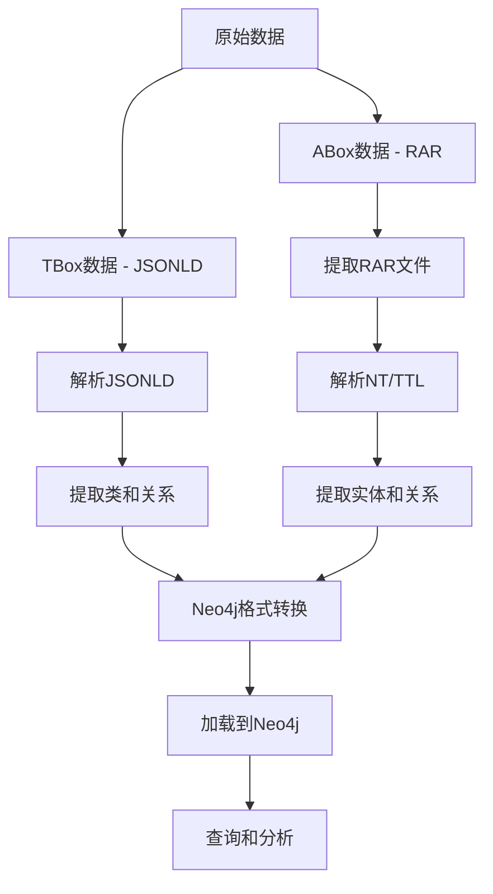

# AliOpenKG 处理工具集

该仓库包含处理阿里开放知识图谱（AliOpenKG）数据集的工具和脚本。这些工具旨在帮助其他研究人员更有效地处理和分析这一大型知识图谱数据集。

## 功能特性

- 处理大型RAR和ZIP压缩格式的知识图谱数据文件
- 解析RDF格式的知识图谱数据（.nt和.ttl文件）
- 将知识图谱数据转换为Neo4j可导入的格式
- 支持对大型文件的分块处理和采样
- 提供知识图谱数据统计和分析功能

## 项目结构

```
AliOpenKG-Tools/
├── src/                    # 主要源代码
├── ecommerce_kg_system/    # 电商知识图谱处理系统
├── docs/                   # 文档
└── examples/               # 示例和结构说明
```

## 数据集要求

本项目用于处理阿里开放知识图谱（AliOpenKG）数据集。您需要从官方渠道获取该数据集，并按照以下目录结构组织：

```
/您的工作目录/
├── AliOpenKG_TBox/         # 本体(TBox)数据
├── AliOpenKG_ABox_Part1/   # 实例(ABox)数据第1部分
├── AliOpenKG_ABox_Part2/   # 实例(ABox)数据第2部分
...
└── AliOpenKG_ABox_Part8/   # 实例(ABox)数据第8部分
```

## 安装与配置

### 环境要求

- Python 3.7+
- Neo4j (可选，用于导入转换后的数据)

### 安装依赖

```bash
pip install -r requirements.txt
```

## 使用方法

### 处理本体层(TBox)数据

```bash
python src/process_tbox_jsonld.py --input AliOpenKG_TBox/your_tbox_file.jsonld --sample 5000
```

### 处理大型RAR压缩的实例层(ABox)数据

```bash
python src/process_large_rar.py --file AliOpenKG_ABox_Part1.rar --extract --convert
```

### 处理NT格式实例数据并加载到Neo4j

```bash
python src/process_large_rar.py --file extracted_data/some_file.nt --convert --load
```

## 数据处理流程



## 注意事项

- 这些脚本设计用于处理大型数据文件，请确保有足够的磁盘空间和内存。
- 处理大型文件时可能需要较长时间，建议使用`--sample`参数先进行采样测试。

## 贡献指南

欢迎贡献代码和提出建议！请通过GitHub Issues或Pull Requests参与项目。

## 许可证

MIT License